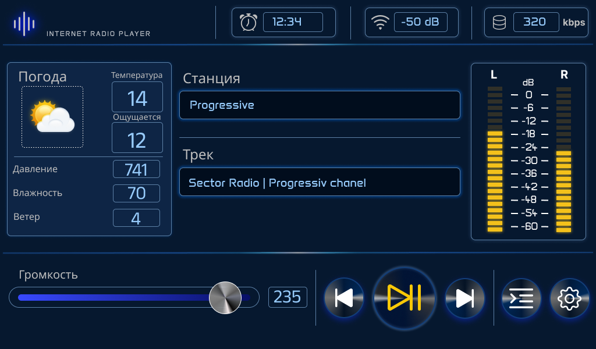

# Voltagenix Stream One Firmware

[Русский](#русский) · [English](#english)

Fork of [yoRadio](https://github.com/e2002/yoradio) for **Voltagenix Stream One**: ESP32-S3 web radio with a **DWIN DGUS II** touch display (`DMG10600C070`, 1024×600) and **PCM5102** I2S DAC.

Репозиторий: <https://github.com/olegww/voltagenix-stream-one-firmware>



*Player (DGUS II, 1024×600): погода / weather, станция и трек, VU, громкость и управление.*

---

## Русский

### Что это

Интернет-/SD-радио на базе yoRadio с отдельным драйвером дисплея **DWIN (DGUS II)** вместо TFT/OLED/Nextion. Прошивка общается с панелью по UART (протокол 5A A5), веб-интерфейс yoRadio сохранён.

| Компонент | Модель / роль |
|---|---|
| MCU | ESP32-S3 (N16R8 и аналоги) |
| Дисплей | DWIN `DMG10600C070_03WTC`, T5L, DGUS II, 1024×600 |
| Аудио | PCM5102 (I2S) |
| ПО | yoRadio + `DSP_CUSTOM` / DWIN VP `0x5000+` |

В логе загрузки `display: 101` — драйвер DWIN. Значение `0` (headless) для этой сборки неверно.

### Возможности этой ветки

- Player: play/stop, prev/next, громкость (кнопки + слайдер), станция/трек (scroll), часы, bitrate, RSSI, VU
- Плейлист на дисплее (страницы, выбор строки)
- Погода OpenWeatherMap → VP и иконки на DWIN
- Хаб настроек на дисплее (навигация по экранам); яркость — **локально в меню DGUS**, без ESP
- Веб: штатный `/settings.html`, плейлист, Wi‑Fi AP-форма на `192.168.4.1`
- Отдельная задача UART/DWIN (~10 мс), чтобы касания не терялись при блокировке отрисовки

Графика HMI в репозиторий не входит: экраны собираются в **DGUS Tool** по контракту VP.

### Подключение

Пины в [`yoRadio/myoptions.h`](yoRadio/myoptions.h).

**DWIN (UART2, TTL 3.3 V, 115200 8N1)**

| ESP32-S3 | DWIN | Назначение |
|---|---|---|
| GPIO4 | TX (UART2) | DWIN → ESP |
| GPIO2 | RX (UART2) | ESP → DWIN |
| GND | GND | общая земля |
| 5 V | 5 V | питание панели |

На плате дисплея джампер **UART2 = ON (TTL/CMOS)**. OFF = RS232 → `LINK FAIL`. Используйте разъём **UART2** (10-pin), не UART4.

**PCM5102**

| ESP32-S3 | PCM5102 | Назначение |
|---|---|---|
| GPIO5 | BCK | bit clock |
| GPIO6 | LCK / WS | word select |
| GPIO7 | DIN | data |
| **GND** | **SCK** | без MCLK — **обязательно на GND** |
| GND | GND | общая земля |

Типичная «тишина»: SCK не заземлён. Выход линейный — нужен усилитель или активная колонка.

### Сборка (PlatformIO)

```bash
pio run -t uploadfs          # SPIFFS: yoRadio/data (веб-UI)
pio run -t upload            # прошивка
pio device monitor           # 115200
```

При необходимости: `--upload-port COMx`. После смены SPIFFS очистите кэш браузера или откройте страницу в приватном окне.

Первый запуск без Wi‑Fi: точка доступа **yoRadioAP** / `12345987` → <http://192.168.4.1/>.

Arduino IDE: открыть `yoRadio/yoRadio.ino`, плата **ESP32-S3 Dev Module**, настройки в `myoptions.h`.

### HMI (DGUS Tool)

Документация в [`hmi/`](hmi/):

| Документ | Содержание |
|---|---|
| [hmi/README.md](hmi/README.md) | обзор проекта HMI |
| [DWIN_SCREEN_MAP.md](hmi/DWIN_SCREEN_MAP.md) | карта VP, wiring, Serial-чеклист |
| [MINIMAL_PLAYER.md](hmi/MINIMAL_PLAYER.md) | первый экран Player |
| [PLAYLIST_PAGE.md](hmi/PLAYLIST_PAGE.md) | плейлист |
| [WEATHER.md](hmi/WEATHER.md) | погода |
| [SETTINGS_PAGE.md](hmi/SETTINGS_PAGE.md) | хаб настроек и связанные страницы |
| [FONT_GUIDE.md](hmi/FONT_GUIDE.md) | классические `.bin` шрифты |

VP приложения: от `0x5000`. Системные DGUS: `0x0082` (яркость), `0x0084` (страница). Готовый пакет с SD → `DWIN_SET` на FAT32 microSD при выключенной панели.

Отладка кнопок: `DWIN_DEBUG 1` в `myoptions.h`, Serial 115200 — см. чеклист в `DWIN_SCREEN_MAP.md`.

### Отличия от upstream yoRadio

- Добавлен стек DWIN (`yoRadio/src/displays/dwin/`)
- Целевая конфигурация — ESP32-S3 + DWIN + PCM5102
- Документация HMI и проверенная схема подключения
- Upstream-фичи (MQTT, HA, множество TFT) в дереве могут оставаться, но рабочий путь этой сборки — DWIN

### Благодарности и лицензия

Основано на **[ёRadio / yoRadio](https://github.com/e2002/yoradio)** (e2002) и библиотеке ESP32-audioI2S.  
Лицензия: см. [LICENSE](LICENSE). Описание оригинала на 4PDA и Wiki upstream остаются полезны для веб-UI, плейлиста и общих настроек.

---

## English

### What this is

A yoRadio-based internet/SD radio with a dedicated **DWIN (DGUS II)** display driver instead of TFT/OLED/Nextion. The MCU talks to the panel over UART (5A A5 protocol). The stock yoRadio web UI is kept.

| Part | Model / role |
|---|---|
| MCU | ESP32-S3 (N16R8 and similar) |
| Display | DWIN `DMG10600C070_03WTC`, T5L, DGUS II, 1024×600 |
| Audio | PCM5102 (I2S) |
| Software | yoRadio + `DSP_CUSTOM` / DWIN VPs from `0x5000` |

Boot log `display: 101` means the DWIN driver. `display: 0` (headless) is not the correct mode for this build.

### Features in this fork

- Player: play/stop, prev/next, volume (buttons + slider), station/title scroll, clock, bitrate, RSSI, VU
- On-display playlist (paging, row select)
- OpenWeatherMap → DWIN VPs and weather icons
- On-display settings hub (screen navigation); panel brightness is **local in DGUS**, not via ESP
- Web: stock `/settings.html`, playlist tools, captive AP form at `192.168.4.1`
- Dedicated UART/DWIN task (~10 ms) so touches still work while drawing is locked

HMI artwork is **not** in the repo: build pages in **DGUS Tool** using the VP contract.

### Wiring

Pins are set in [`yoRadio/myoptions.h`](yoRadio/myoptions.h).

**DWIN (UART2, TTL 3.3 V, 115200 8N1)**

| ESP32-S3 | DWIN | Role |
|---|---|---|
| GPIO4 | TX (UART2) | DWIN → ESP |
| GPIO2 | RX (UART2) | ESP → DWIN |
| GND | GND | common ground |
| 5 V | 5 V | panel power |

On the display board set **UART2 jumper = ON (TTL/CMOS)**. OFF = RS232 → `LINK FAIL`. Use the **UART2** 10-pin header, not UART4.

**PCM5102**

| ESP32-S3 | PCM5102 | Role |
|---|---|---|
| GPIO5 | BCK | bit clock |
| GPIO6 | LCK / WS | word select |
| GPIO7 | DIN | data |
| **GND** | **SCK** | no external MCLK — **tie to GND** |
| GND | GND | common ground |

Most “no sound” cases are an floating SCK. Line-level out needs an amp or active speakers.

### Build (PlatformIO)

```bash
pio run -t uploadfs          # SPIFFS: yoRadio/data (web UI)
pio run -t upload            # firmware
pio device monitor           # 115200
```

Optional: `--upload-port COMx`. After SPIFFS changes, hard-refresh the browser or use a private window.

First boot without Wi‑Fi: AP **yoRadioAP** / `12345987` → <http://192.168.4.1/>.

Arduino IDE: open `yoRadio/yoRadio.ino`, board **ESP32-S3 Dev Module**, options in `myoptions.h`.

### HMI (DGUS Tool)

See [`hmi/`](hmi/):

| Doc | Content |
|---|---|
| [hmi/README.md](hmi/README.md) | HMI overview |
| [DWIN_SCREEN_MAP.md](hmi/DWIN_SCREEN_MAP.md) | VP map, wiring, serial checklist |
| [MINIMAL_PLAYER.md](hmi/MINIMAL_PLAYER.md) | first Player screen |
| [PLAYLIST_PAGE.md](hmi/PLAYLIST_PAGE.md) | playlist page |
| [WEATHER.md](hmi/WEATHER.md) | weather |
| [SETTINGS_PAGE.md](hmi/SETTINGS_PAGE.md) | settings hub and related pages |
| [FONT_GUIDE.md](hmi/FONT_GUIDE.md) | classic `.bin` fonts |

App VPs start at `0x5000`. DGUS system regs: `0x0082` (brightness), `0x0084` (page). Flash the generated `DWIN_SET` from a FAT32 microSD with the panel powered off.

Button debug: `DWIN_DEBUG 1` in `myoptions.h`, Serial 115200 — checklist in `DWIN_SCREEN_MAP.md`.

### Differences from upstream yoRadio

- DWIN stack under `yoRadio/src/displays/dwin/`
- Target path: ESP32-S3 + DWIN + PCM5102
- HMI docs and a proven wiring table
- Upstream extras (MQTT, HA, many TFTs) may still exist in-tree; this product path is DWIN

### Credits and license

Based on **[ёRadio / yoRadio](https://github.com/e2002/yoradio)** by e2002 and ESP32-audioI2S.  
See [LICENSE](LICENSE). Upstream Wiki / 4PDA docs remain useful for the web UI, playlists, and shared settings.
